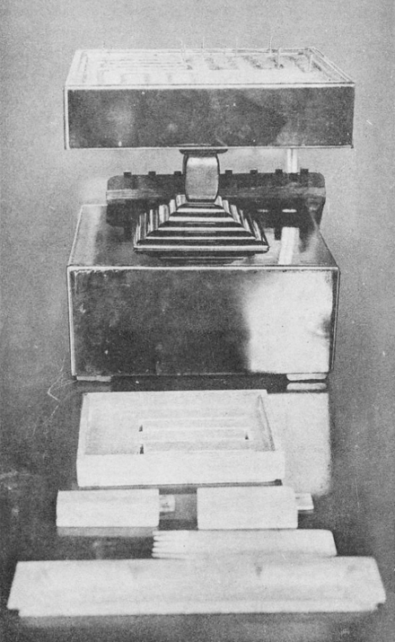
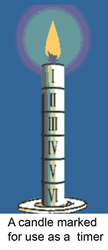
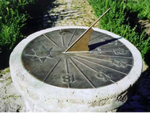
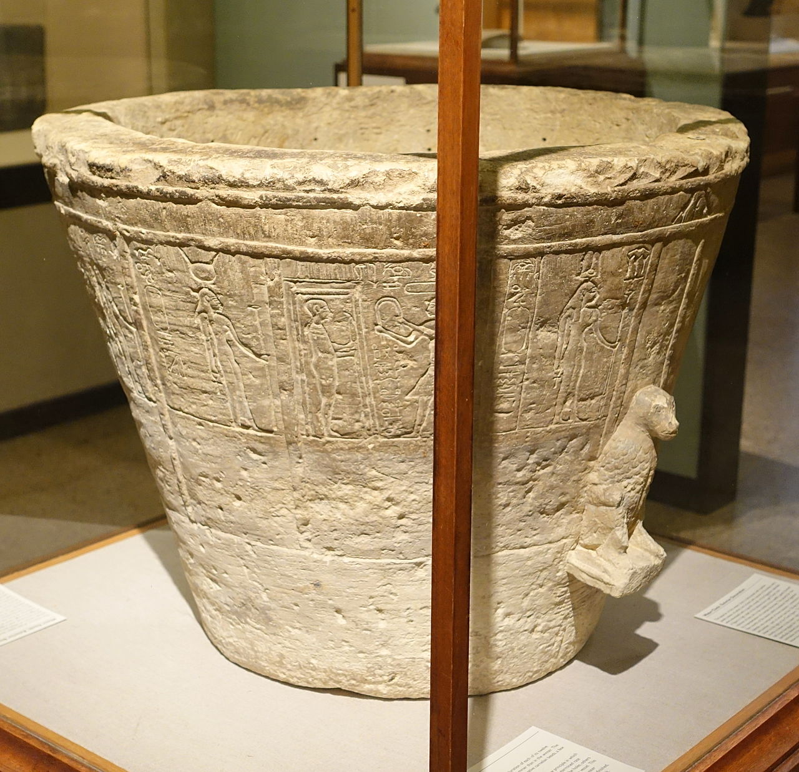

# Time Functions: Crazy Clock Mini Project

### When to Use

This lesson involves several built-in functions to the p5 libraries that return values based on the current time. This means that it could best be used in the following places:

* **Earliest:** After **U1LA2.2 Custom Variables in p5.js**, as a way to reinforce saving values to variables and using variables. _Students would not yet be able to use conditionals in their projects._
* **Most Ideal/Natural Flow:** After **U2LA1.4 The Map Function**, as students will be able to use conditionals to plan changes in their program based on time as well as using the map function to map values out of 24/60 to other ranges on the canvas.
* **Natural Flow:** During **Unit 5**, as students are learning about functions that return value. _All of the functions used here return value!_

### Overview && Teacher Feedback

This is meant to be a mini-lesson combined with a mini-project as practice. Students will learn about the functions built into the p5.js library that return time values, and then will save those values into variables and use them to create a 'clock' application that will tell time in a creative, non-traditional way.

The lesson will work best if students can not only utilize these variables, but also conditionals and perhaps the map function. Prepare to question students who may not be used to analog clocks, much less other ways to tell time that are non-digital.

### Suggested Duration

\~1 - 3 Periods (45 - 235 Minutes), dependent on how much time you would like to give to this project.

### NYS Standards

**9-12.IC.6** Create accessible computational artifacts that meet standard compliance requirements or otherwise meet the needs of users with disabilities. (_Project framing dependent._)

**9-12.CT.2** Collect and evaluate data from multiple sources for use in a computational artifact.

**9-12.CT.7** Design or remix a program that utilizes a data structure to maintian changes to related pieces of data.

### Vocabulary

* **day()** - returns current day as an integer from 1-14
* **hour()** - returns current hour as an integer from 0-23
* **minute() -** returns current minute as an integer from 0-59
* **month()** - returns current month as an integer from 1-12
* **second()** - returns current second as an integer from 0-59
* **year()** - returns current year as a four-digit integer (based on your computer clock)

_**NB**: There is also a millis() function, but it returns milliseconds after a program has begun running, not the current time based on your computer clock. Use as you see fit!_

### Planning Notes

| Planning Notes | Materials Needed |
| :------------: | :--------------: |
|                |                  |

### Resources

* [Ways of Telling Time Through History](https://nrich.maths.org/6070) (Article)
* [Ancient Time Keeping](https://www.worldhistory.org/Timekeeping/#:\~:text=The%20earliest%20method%20of%20measuring,five%20planets%20known%20in%20antiquity.\&text=For%20example%2C%20Egyptian%20and%20Minoan,aligned%20to%20observe%20particular%20stars.) (Article)

### Assessment


### Do-Now/Warm Up

What are all the different ways you can imagine to tell time, or keep track of how much time has gone by? List as many as possible (and feel free to think of contemporary and historical examples!)

### Telling Time Throughout History

After the Do-Now, ask students to share their ideas. Once the ideas have been exhausted, share that throughout history, humans have had many different - and often creative - ways to mark the passage of time that do not always look like the clocks we are used to today. The earliest methods involved tracking celestial bodies (the sun, moon, stars, and planets) as well as major events (leaves changing, animal migration) and season changes. Eventually, human inventors began creating devices that could tell time. Some examples are (review as many and whichever you think will most inspire your students):

* Sundials - came in several different forms and would use sun and shadows to display and show the passing of time.
* Oil Lamps/Marked Candles - oil lamps would have markings that would show how much time had passed based on the oil left. Candles would be created and marked with each marking representing a unit of time, so as the candle burned down, you knew how much time was left/how much had passed.
* Incense Clocks - popular in ancient India and China, they would involve burning incense that had a specified burn time. As time passed, incense of different scents would begin to burn to mark the passage of time along with the specific trail of ash that was left.
* Water clocks - these developed in several forms across the ancient world, but each had a way of measuring and releasing water over time so that time could be read based on different marks, or the level of something floating in a vessel.
* Hourglass - contained sand or another material that would be poured from one half to another.

   

Each of these methods allowed users to tell time, even if it was not in the hour:minute:second (or, on a larger scale, the day:month:year) format that we are used to seeing. Today, you will be using some of the functionality of p5.js to build your own unique clock - don't expect that it will tell time as you're used to, but it should do \*something\* to show that at least three time values are passing!

### Time in p5.js

First, we need to figure out how we can capture the current time in p5.js. Ask students to get out their computers and point themselves to the p5 editor window (or wherever else you choose to code). Then, code along to explore some of the basics of time in p5.js

Begin by preview the different functions that students will be able to use from to get time values. The focus of the lesson will be on second(), minute(), hour(), but there is also day(), month(), and year(). Start off with this very basic example of capturing data and getting it to print in the console:

```
function setup() { 
  createCanvas(400, 400); 
}

function draw() { 
  background(220);
  var theHour = hour() 
  var theMinute = minute() 
  var theSecond = second()
  console.log(theHour + ":" + theMinute + ":" + theSecond) 
}
```

Note that in this example, we have made all the variables inside the draw function. This is because we are not using them anywhere else, and they all need to get their value in the draw function (which, we recall, runs forever as a repeating loop). If we wanted to use them in other p5 functions, we would need to declare our variable names globally (above setup) and then assign value during the draw function.

As a best practice, explain this while the code is running so that a minute elapses. Students should immediately see the second change, but it can feel more real feeling the second change, too. Explain that the values are coming from their computer clock and will update as the clock does each time the draw loop is run.

From there, remind students that each of these values is just a number. Where have we used numbers before in p5.js? (Their answers should vary, but almost everywhere - LOTS of arguments in our code functions are controlled by numeric values!) Explain that anywhere we have used a number before, we can use one of these variables that holds a number based on time, instead. Consider this simple example:

```
function setup() {
  createCanvas(400, 400);
}

function draw() {
  background(220);
  
  var theSecond = second()
  
  ellipse(200, 200, theSecond) 
}
```

In this example, our ellipse will slowly change size based on the current second. We may notice, however, that this circle gets really small and never becomes super large. If we want it to behave differently, we could use our friend the map function, like so:

```
function setup() {
  createCanvas(400, 400);
}

function draw() {
  background(220);
  
  var theSecond = map(second(),0,59,20,200)
  
  ellipse(200, 200, theSecond) 
}
```

Here, the change is a bit more noticeable. We are mapping the value returned from the second() function from its original range of 0-59 to a range of 20 - 200. This means when the seconds read 0, the circle will be 20 pixels in size. When the seconds read 59, it will be 200, and anything else will be a value (proportionately) set in-between.

We could also use time to trigger different things to happen on the screen based on conditions being met. Let's build an example together:

```
var bgColor

function setup() {
  createCanvas(400, 400);
  bgColor = 220
}

function draw() {
  background(bgColor);
  
  var theSecond = map(second(),0,59,20,200)
  var theHour = hour()
  var theMinute = minute()
  
  ellipse(200, 200, theSecond)
  
  if(theHour > 12){ //teahers - swap the > for < to show students the change since hours move slowly
    bgColor = 0
  }
  else{
    bgColor = 220
  }
}
```

### Make a Creative Clock

Once you've gone through enough examples that students understand the potential for these values, give them their task. They will be making their own creative clock using at least three values (but they can work in day/month/year as they see fit).

This clock can do _anything_ and combine any past skills they've learned. It is not necessary for the app to look like a clock, or to display the time as text. All that is required is that the design change as time passes so that if someone understood the rules, they could use it to mark the passage of time. They can choose to use many shapes (and even reuse variables in multiple places) or just one, the map function and/or conditionals - it's up to them (and you, if you'd like to set more rigid parameters for the project).

Get students working either independently or in pairs to create their masterpiece. As they work, be sure to circulate to assist and offer suggestions to push their clocks to the next level.

### Wrap Up

Once students are done, give everyone a chance to look at the other clocks that have been made. You might do this with informal presentations, a gallery walk, or whatever else makes sense to you.

If you are having students submit this work, consider asking them to also submit a written component where they explain how their program could be used to tell time.

If you are using this course as an AP prep course, this is a great time to have students practice making videos of their programs running, which they will need to do for the AP Create Task.

### Extensions

* Consider doing a mini lesson on the modulo (unless students have done the optional timers lesson and already learned about it) so students can make things happen at different time intervals.
* If you would like this to be a longer project, consider giving students the challenge to make a 24-hour clock, where time is tracked but also something different and specific happens in each of the 24 hours in a day.
