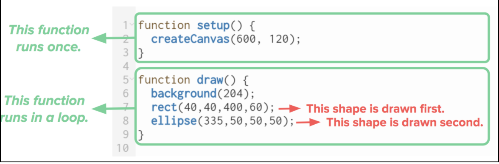
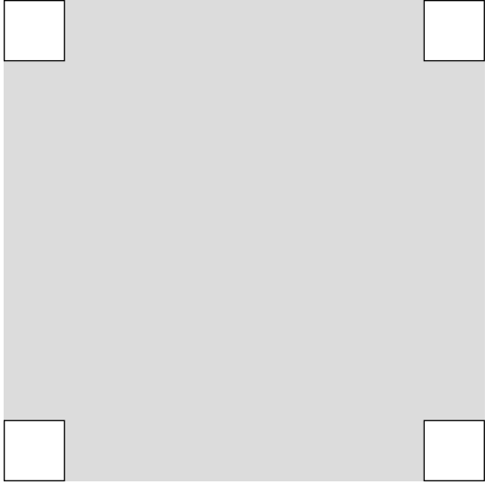
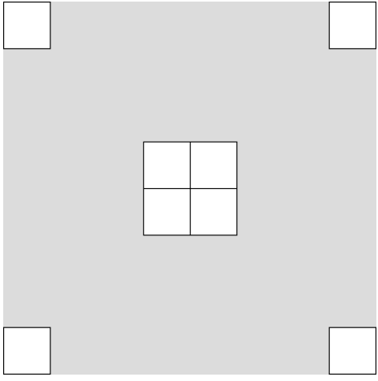

# U1LA1.3: Rectangles, Ellipses, and Layering

### Overview && Teacher Feedback

In this learning activity, students will create a visual composition using the p5 shape functions rect() and ellipse(). They will continue to build on their understanding of functions and their parameters to recreate the robot from lesson 1. \
This lesson is split into three parts: drawing rectangles, drawing ellipses, and coding the robot. 

In lesson 1, we practiced abstraction with the unplugged robot activity, today they will get the opportunity to code their robot.

The do-now will give students an opportunity to create a new robot (or multiple robots) and make revisions to their existing robot. 

Have extra copies of the worksheet because students may make mistakes (or may have lost their sheet prior to this class). 

**NB**: There are two activities to practice rectangles and ellipses. Offer multiple opportunities for students to display and explain their work to the class or peers.

Some students may want to add color, but that lesson won’t be introduced until U1LA3.  The student focus should be on drawing using functions from the p5.js library. Trust the process that styling will come later! 

This lesson provides opportunities for pair programming. Please note that paired programming opportunities should always have an equal number of “at-bats” for each student.

### Objectives

| <p><strong>Students should be able to:</strong><br><strong></strong></p><ul><li>Consult the p5 reference</li><li>Create rectangles using the rect() function</li><li>Create ellipse using the ellipse() function</li><li>Understand the concept of layering to create images using multiple shape functions</li></ul> |
| --------------------------------------------------------------------------------------------------------------------------------------------------------------------------------------------------------------------------------------------------------------------------------------------------------------------- |

### Suggested Duration

\~1 period, 45 minutes\
(This may require some extension depending on how elaborate students were with their robots, but they will come back to this project later!)

### Blueprint Foundational Student Outcomes

| <p><strong>Abstraction:</strong><br><strong></strong></p><ul><li>Give examples of specific patterns in something I can see, do or touch.</li><li>Describe different things I tried in order to achieve a goal.</li><li>Explain how I might help others identify patterns.</li></ul><p><strong>Algorithms:</strong><br><strong></strong></p><ul><li>Describe more than one set of instructions that might complete a task.</li><li>Explain why I used specific instructions to complete a task.</li><li>Compare and contrast my instructions with other instructions that complete the same task.</li></ul><p><strong>Programming:</strong><br><strong></strong></p><ul><li>Experiment with the commands of a programming language.</li><li>Describe three ways a development environment helps me create a project.</li><li>Explain why I chose specific commands to communicate my instructions.</li><li>Discuss what can and cannot be done with a specific set of commands.</li></ul> |
| ---------------------------------------------------------------------------------------------------------------------------------------------------------------------------------------------------------------------------------------------------------------------------------------------------------------------------------------------------------------------------------------------------------------------------------------------------------------------------------------------------------------------------------------------------------------------------------------------------------------------------------------------------------------------------------------------------------------------------------------------------------------------------------------------------------------------------------------------------------------------------------------------------------------------------------------------------------------------------------------- |

### **Vocabulary**

| <ul><li><strong>Function - </strong>Functions are lines of code that perform specific tasks.</li><li><strong>Parameters - </strong>Are the values inside of a parenthesis following the name of the function.</li><li><strong>rect() function - </strong>Draws a rectangle to the screen.</li><li><strong>ellipse() function - </strong>Draws an ellipse (oval) to the screen.</li></ul><p><strong>Pre-Req Vocab:</strong><br><strong></strong></p><ul><li><strong>Width - </strong>Horizontal distance of a 2D shape </li><li><strong>Height - </strong>Vertical distance of a 2D shape</li><li><strong>Rectangle - </strong>a 2D figure with four straight sides and four right angles</li><li><strong>Ellipse - </strong>a regular oval shape</li></ul> |
| ---------------------------------------------------------------------------------------------------------------------------------------------------------------------------------------------------------------------------------------------------------------------------------------------------------------------------------------------------------------------------------------------------------------------------------------------------------------------------------------------------------------------------------------------------------------------------------------------------------------------------------------------------------------------------------------------------------------------------------------------------------- |

### **Planning Notes**

| Planning Notes                                                                                                                                                                                                                                | Materials Needed                                                                                                                  |
| --------------------------------------------------------------------------------------------------------------------------------------------------------------------------------------------------------------------------------------------- | --------------------------------------------------------------------------------------------------------------------------------- |
| <p></p><ul><li>Students might have lost their robot or may want to redo it from lesson. </li><li><p>Students will need 3 tabs open </p><ul><li>Alpha Editor </li><li>Slide Decks (optional)</li><li>P5.js Reference Guide</li></ul></li></ul> | <p></p><ul><li>Computer or laptop </li><li>Pens/Pencils</li><li>Rulers</li></ul><p>Highlighters || Colored Markers (optional)</p> |

### Resources

* [Basics of Drawing](https://youtu.be/D1ELEeIs0j8) (Youtube Video)
* [Layering Example](http://alpha.editor.p5js.org/SEP/sketches/S1aG4fO7m)
* [Robot Worksheet](https://drive.google.com/file/d/1ZmERZDHhM4A7TB27mQcxrcPJeAi5Z0m8/view?usp=sharing)
* [Intro to Editor && Hello Ellipse](https://youtu.be/5PLmJPPTr88) (Youtube Video w/ Code Activity)
* [Intro to Rectangle](https://youtu.be/ImrdUICLfzs) (Youtube Video w/ Code Activity)

### Assessments

**Formative**: Creating ellipses and positioning, Creating rectangles and positioning\
**Summative**: Coding robot in p5.js, Taijitu symbol

### Do Now/Warm Up

This will be an unplugged activity, it is important to review how to find the positions and sizes of the shapes used to create the robot the drew and deconstructed in lesson U1LA1.1 Ask student to take out their robot worksheet and add or make changes to it.

To review how rectangles and ellipses work in p5 ask students ask the following:

\*Which corner is used to determine the position of a rectangle? \
**\***What two values are used to determine the position of a rectangle?\
\*Is the width and the height of the ellipse a diameter or a radius?  

### Draw a Rectangle (10 Min)

Bring students back together to briefly code-along the rect() function. They should first be introduced to it along with its parameters and with examples showing different values for width and height. 

Begin by introducing the rectangle function and how it works. You may have students copy it into their notes or add it onto a function poster around the classroom.\
****\
****As you code discuss the following: 

* How many parameters does rect() accept? Use the [reference](https://p5js.org/reference/#/p5/rect) to show its arguments. 
* How can we tell what are the “x” and “y” values of the position of a rectangle or other shapes? 
* Students can copy & paste this line of code onto future sketches. This line of code displays the “x” and “y” value of the mouse location while on the canvas. 

```
function setup() { 
	createCanvas(600, 120);
}
function draw() { 
	background(100);
      text(mouseX + ", " + mouseY, 20, 20);
}
```

After discussing the rect() function give students a moment to practice adding more rectangles, either with criteria you have given, or anywhere they'd like.

### Drawing Order

Some questions may come up about layering or drawing order if so tell them that in p5, shape and color functions are rendered to the canvas in the order they're written in the program - from top to bottom.\
****\
**Algorithms - **Drawing order and control flow in p5.js is an important CS practice. This concept will appear often throughout the course. 



### Student Practice #1 (5 Min)

Ask students to complete the challenge of recreating the following shapes on their canvas. **NB: **The real challenge is recognizing how to get all their edges to show!





[Solution Code](http://editor.p5js.org/Jorea/sketches/SkeFVNOzX)

This activity will reinforce students’ knowledge of coordinate points and positioning on the canvas. Some calculations will be needed in order to get the rectangles in the corner. Have some present their work and explain their solutions to the rest of the class.

Some students may want to create more squares or experiment with sizing.  Circulate the room to ensure students are using comments to label the different rectangles. 

**Ask students: **

What is the relationship between the x & y coordinates and the height & width?\
Explain your process for layering the rectangles in the challenge.

### Draw an Ellipse** (5 min)**

Bring students back together to briefly code-along the ellipse() function. They should first be introduced to it along with its parameters and with examples showing different values for width and height.

**As you code, discuss the following:**

Why is the x and y in the center? There is not vertex for the ellipse to use as a starting point for the width and height. It is also made that way in case we cant to draw an oval instead of a perfect circle.

Are the width and height radius or diameter? The width and height of an ellipse will serve as diameters. So that means if the height is 50 px then the radius is 25 px from the (x, y) to the top and 25 px to the bottom. Same with the width, it works horizontally.

### **Student Practice #2 (5 **m**in)**

Ask students to add to their first practice by inscribing an ellipse in each rect, like so:


This activity will reinforce students’ knowledge of coordinate points and positioning on the canvas. Some calculations will be needed in order to get the ellipse in the corner. \


* Ask students to modify their code from before and add ellipsis to the center of their rectangles. 
* Circulate the room to ensure students are using comments to label the different shapes.
* Students should duplicate their previous sketch so that they don’t have to code one from scratch and keep a copy of their original sketch. 
* Have some present their work and explain their solutions to the rest of the class.

[Possible Solution](http://alpha.editor.p5js.org/Jorea/sketches/BJa7cNdz7)

### Draw Your Robot (10 min)

**NB**_: This can also be a take home project_

Draw in p5.js the robot that you made on graph paper.

Students who are having trouble with positioning can use this [starter sketch](http://editor.p5js.org/owenroberts/sketches/S1N-5TAGQ) that contains the following:

* Mouse canvas position indicator (x, y)
* Adaptable grid

Make sure students read the comments in the code as they serve as instructions!

### Wrap Up (3 min)

Ask 2-3 students (preferably that have volunteered, or you have checked-in with) to share their code for the robot to the class. Try to call on students whether they have the right or wrong code and prompt the class to coach students through errors - this can begin to build a culture celebrating errors as learning moments. Shares work best if you make them a consistent part of your routine.

Ask Students:

1. When creating the robot what is the most important information that we need to gather?
2. What is a good way to keep track of shape order and layering? Provide an example.
3. What are the step to took to overcome any confusion or difficulties? 
4. Explain how the coordinate system works in relation with rect() ant ellipse()

### **Extension**

_**Ask students to check out the p5.js online reference and add more shapes to their robot.**_\
****

###  
