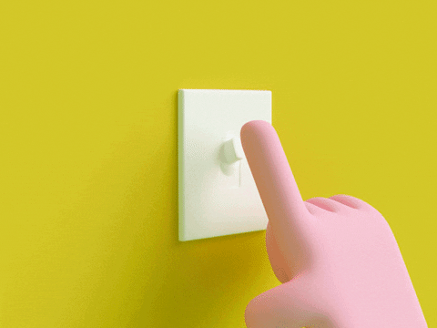
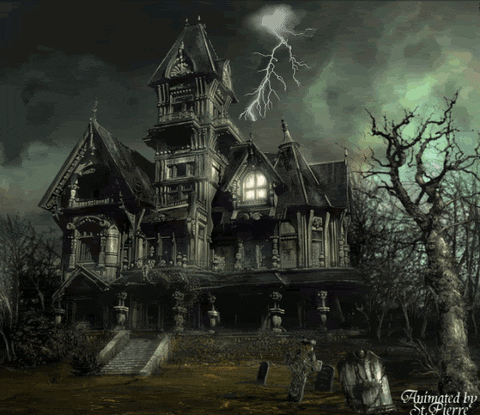

# 🗃 🗃U2LA2 Mini Project: Light Switch Game

### Prompt

 

_**Congratulations**_! Your great aunt’s second cousin twice removed (on your mother’s side) has recently left you a spooky old house. This is great, because “free house”. As you can imagine, however, this does come with its fair share of problems, because it is spooky, and it is old.

The biggest problem your great aunt’s second cousin twice removed’s attorney warns you about when handing over the deed is that the wiring in the house is pretty old and nonsensical. Sometimes, a light switch controls multiple lights: it might turn more than one light on at a time, and will also turn some lights off. Because the house is spooky, you need to figure out how to turn all of the lights on as quickly as possible.

The attorney recommends you try to make this into a game to help you practice and to distract you from the dark foreboding shadows that definitely are not hiding anything you need to worry about (but let’s turn the lights on just in case?).

Create a p5 program that will have at least 6 buttons - your light switches. Each light switch should control several other lights, and maybe also the light you clicked. Create a solvable puzzle game in which you need to find the right order to press the switches so all lights are turned on at once.

**Requirements**:

_Work with a partner to complete the following:_

1. Create a game with at least six clickable buttons.&#x20;
2. Create a flowchart of your game so you can guarantee that there is a combination of switches that you can click to turn them all on, solving the puzzle.&#x20;
3. Create a p5 program where each switch turns a combination of lights on and/or off. **Utilize an object to store the colors (or whatever property you are changing) for all of the lights!**&#x20;
4. Add any necessary design elements to make this game look appealing!

**Writing Prompt:**

Describe your design process, including stepping through the code to explain exactly how to reach a solution and why your solution works.

**Sample Output**

_N/A - figure it out!_

### Extensions

* Figure out how to draw a new background and “scene” if you win, so that the player knows they have completed the challenge.&#x20;
* Figure out how to keep score, and make something happen if the user has clicked too many times without solving the puzzle.

### Do-Now/Launch

Ask students what buttons can control - make sure they understand that buttons can control things outside of themselves. (EX: A circle button can change the color of a different, rectangular button when clicked) During the lesson launch, feel free to play up the prompt to make this as fun and engaging to your students as possible!

### Prompt Launch

This prompt is really a clever facade to get students to approach a complex logic puzzle; the coding is no more difficult than what they did in their button lessons, but the logic of making this work will be a trial.&#x20;

For this reason, it is recommended that students use this as their first big pair-programming project. Having a thought partner for this activity will go a long way in making it feel manageable. It’s strongly suggested that pairs make a plan - via flowchart, wireframe, or other - and show it to the teacher before they are allowed to begin programming.&#x20;

Once students begin programming, they are encouraged to work on one computer and maintain the driver/navigator roles. While this isn’t a clear-cut project with an equal number of ‘at bats,’ swaps can be controlled by time. Consider playing music and announcing student swaps every two songs (or roughly every 10 minutes). Be mindful when circulating to ensure students are staying true to this structure.

_****_
