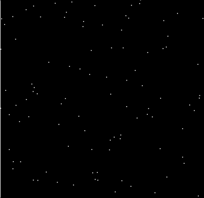

# 🗃 🗃U3LA2 Mini Project 2: Random Starfield

### Teacher Notes

Much as with U3LA2.2 on arrays and random, this mini-project is mostly an extension of the lesson before it (U3LA2.3: Loops and Arrays). As such, you're welcome to treat this as a mini-project roll out, or as a projectified practice from the previous lesson. Take your pick! This particular mini project can probably be completed in a single period, so it is not something that will eat up an entire week of instruction.

### Prompt

Now that you know how to populate arrays with random values, we are going to create a random _star map_ - yes, the same thing you see when you look up at the sky at night (provided you're far enough outside the city to avoid light pollution), but this time on your computer.

**TASK**

Create a program that will generate a random star map each time the program is run. Your project must include the following:

**REQUIREMENTS**

1. Create a new project and change the canvas size to read: createCanvas (windowWidth, windowHeight). _This will ensure it fills the entire window regardless of the window size!_
2. Set a dark background and light colors for your stars.
3. Create an empty array that you will populate with objects to produce randomly placed stars. The objects must have an x and y, but you can also decide on other properties like color (make them vary slightly from plain white), opacity, strokeWeight/color, etc. It's up to you if you draw tiny ellipses or points that you make bigger with strokeWeight!
4. Use the now full array of random star objects to draw a star map.

### Sample Output

### Extensions

In and of itself, this is not a wildly challenging project after the last lesson, but it sure looks cool. Aim to complete a few of the following extensions:

1. Make a separate array of randomly generated planets. (Still small, but perhaps slightly larger than the stars, or with varied colors/attributes.)
2. Create a function that will allow the user to draw to connect constellations.
3. Add interactivity to some of the stars so when they are touched by the mouse, something happens. (What happens is up to you! Maybe an alien appears? 👽)
4. Investigate vectors in the p5 reference sheet. This is a special type of p5 object that automatically has an x and y property!
