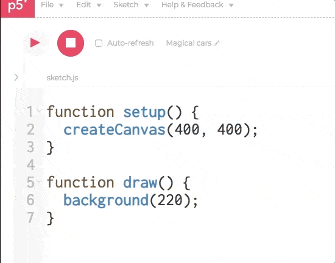

# U3LA3.1: Preload && Images

### Overview && Teacher Feedback

This learning activity demonstrates asynchronous calls and the need to use p5\`s preload function or callback functions to make sure media files are fully loaded before trying to access them in our sketches. We will not be doing any coding yet.

This lesson introduces a lot of skills that students will use throughout unit 3. That being said, it can be a bit dry - try to chunk the lesson so that students are not listening to a straight lecture and have time to explore, even if that exploration is just finding images.

Many students have limited experience with saving files locally. Anticipate needing to teach a lot of \[what you might think of as] basic skills, including naming conventions for files. Ideally, files should follow the same rules as variables - camel case and no spaces.

Anticipate that students may also struggle with image file types - a common error is for students to accidentally save something that is not a compatible image (due to clicking the wrong option) and not realizing what they did. Because of this, we plan in time to discuss file types/extensions - this knowledge will be built onto in AP CSP, when students will also discuss lossy and lossless compression.

Some students may want to put gifs into their designs - to put in gifs that move, students need to add them as an HTML element vs. an image in p5. This is doable, but try to get students to focus on stationary images for this project and save the gif exploration for the future.

### Objectives

Students will be able to:

* Identify image file types to use in their program&#x20;
* Use the preload function to load images from local and web-based files&#x20;
* Add images to their canvas, position, and resize.

### Suggested Duration

1 class period (\~45 minutes)

### Blueprint Foundations Student Outcomes

**Algorithms**

* Explain why I used specific instructions to complete a task.

**Prototype**

* Experiment with the commands of a programming language.&#x20;
* Explain why I chose specific commands to communicate my instructions.

### **Vocabulary**

* preload( ) - a function that loads data before the other functions begin running.&#x20;
* callback - a function that will execute at a certain time, once another task has been completed.&#x20;
* File type/extension - the .EXT after a file determines how a computer interprets the data in the file. Common image file types: .gif, .jpeg, .png, .tiff, .svg

### **Planning Notes**

|                                                      Planning Notes                                                     |        Materials Needed        |
| :---------------------------------------------------------------------------------------------------------------------: | :----------------------------: |
| _There are no specific planning notes for this lesson, but it is the first lesson students will be using media - whoo!_ | _No special materials needed._ |

### **Resources**

* [Finding, Naming, Saving Image Files](https://youtu.be/kr7KjcEm5zg) (Youtube Video)
* [Adding and Displaying Images in p5.js](https://youtu.be/MIKOyE3uUYY) (Youtube Video)
* Coding Train - [Uploading Media Files](https://www.youtube.com/watch?v=rO6M5hj0V-o) (Youtube Video)
* [ p5.js Media Example #1](https://editor.p5js.org/cs4all/sketches/Yy5DF2sOL)&#x20;
* [p5.js Media Example #2 (callback function)](https://editor.p5js.org/cs4all/sketches/3-Ldo0Vsx)

### Assessments

**Formative**

* Collect student work on importing images&#x20;
* Exit Slip

**Summative**

* Mini Project: Vision Board&#x20;
* End of Unit Project: Meme Generator

### Do Now/Warm Up

_Have students respond to the following prompt:_

List the five things that you absolutely cannot start your day without having or doing.

_After students have responded, give time for them to share out. Push students to think about why these things are necessary for their day to be successful. Explain that there are some things that might also be crucial to our programming running and that we want to make sure they happen before anything else takes place._

### File Types & Finding Files

Discuss the goals of this lesson:

1. Figure out how to find and add images to our project&#x20;
2. Make sure images are loaded before our program is run&#x20;
3. Code images to display on our canvas

Before students can continue with a code-along, first establish the basics of file types/extensions and their definitions. Then, introduce students to common types of image files:

|                   Common Image File Types                  |      Sound and Video File Types     |               Other File Types               |
| :--------------------------------------------------------: | :---------------------------------: | :------------------------------------------: |
| <p>.jpeg/.jpg<br>.png<br>.bmp<br>.tiff<br>.gif<br>.svg</p> | <p>.mp3<br>.mp4<br>.wav<br>.aac</p> | <p>.html<br>.pdf<br>.docx<br>.py<br>.web</p> |

**NB:** If you're prepping students for an AP CS course, this would be a great time to sneak in the idea of lossy and lossless file types - but it's not necessary!

Now, to add images into our program, we first need to find some images. Because we are making small, personal projects for the purpose of education, we will be using Google Images and won't be super concerned about the source of our images. **However, it is important for students to know that images may be subject to copyright protection and should always be properly credited in their code via code comments.**&#x20;

If you are so inclined, you may choose to teach students about [copyright](https://www.copyright.gov/what-is-copyright/), [fair use](https://www.copyright.gov/fair-use/more-info.html#:\~:text=Fair%20use%20is%20a%20legal,protected%20works%20in%20certain%20circumstances.\&text=Nature%20of%20the%20copyrighted%20work,purpose%20of%20encouraging%20creative%20expression.), digital licensing, and [creative commons licenses](https://creativecommons.org/licenses/). You can also have students pull from images that are under creative commons/fair use licenses using the following sites, but they can sometimes be limited in scope:

* [Creative Commons Image Search](https://wordpress.org/openverse/?referrer=creativecommons.org)
* [Creative Commons on Flickr](https://www.flickr.com/creativecommons/)
* [Smithsonian Open Access](https://www.si.edu/openaccess)
* Or try searching for 'open source', 'royalty free', or 'stock' photos and see what you can find!

But for now, to Google! There are two different ways that we can get images into our program:

1. We can **save the image locally and add the image file to our program**, which is a best practice to make sure the image is always right where we need it to be and we aren't making too many pull requests for an image that lives on someone else's server space.
2. We can **get the image URL**, which is where the image, in particular, lives on the internet, and use that to put the image in our program. This is a fine solution for our small, personal projects but not a great practice if we were making something bigger or commercial.

We are going to focus on #1 for now, but we will give an example of #2 later in the lesson. It's safe to assume that students have never (or rarely) been asked to save a file locally to their computer as they exist in the generation of the ☁️cloud☁️. Give students one minute (use a timer - it's easy for kids to go down a rabbit hole) one minute to find an image they like of some prompt you've given, like say, a dog. Then, walk them through these steps:

1. Create a new folder somewhere on your computer named after this class. Putting it on the desktop will make it easy to find later.
2. Right-click (this is a command-click or two-finger click if you're using a Mac) the image that you want to save.
3. Scroll down to 'Save Image As...'
4. Give the image a name you will remember. DO NOT use spaces or lead with a number - use the same rules we use for variables when naming images!

After students have saved their first image, show them that they have some control over the results from a google image search. If they click the **'Tools**' button (bottom right under the search bar when in Google Images) it will bring up several options. If they select '**Color --> Transparent**' they will be shown only images with a transparent background, which can be useful when adding to our program. (You can also search by usage rights using the Tools button - just select 'labeled for reuse.') Have students save two more images (preferably with transparent backgrounds) to practice.

Now, let's head to our program. Did you know that there is an entire section of our sketch that p5.js has been hiding from us? When we type into the editor, we have so far just been typing into a Javascript file - but Javascript works alongside HTML and CSS to create websites. This HTML and CSS has been there the whole time, hidden by the p5 Editor. If we click the little arrow on the side, we will expand to be able to see our hidden files - and have a space to upload our own files. While we can look through the HTML and CSS if we want (and those of us with some web dev skills might want to start making fully realized sites!) we are going to mostly ignore them for now.



To upload an image, click the downward arrow next to program-file, select ‘add file’, and drag/drop or select the image you’d like to upload. Once you’ve done this, you can rename the image to an easy filename! Be sure to leave the file’s extension.


Once you've done one image together, ask students to load the other two in for practice. Circulate the room and make sure students can see their images now listed in the sidebar with the other files.

### preload()

p5 can draw images, text with certain font types, and play sounds. In order to display (or play) them, it must first load the file in question. Take a look at the sketch below: we load the birch.png file within setup(), and then call the image function to draw it in draw(). From this code, one would expect to see an image in the sketch. However, chances are you are only seeing the gray background.

```
var tree;

function setup() {
  tree = loadImage("tree.png")
  createCanvas(400, 400);
  //Loop is off so it would load faster
  noLoop()
}

function draw() {
  background(64);
  tint(180,70,60);
  image(tree,200,300,100,200); 
}
```

Why is this happening? Let's look at what loadImage does in more detail. The file birch.png is stored in on a server computer somewhere on the web. loadImage makes a request to the server to send the file to the computer where p5 is running. Image files can be sizeable: the transfer takes some time. This would not be a problem if Javascript, the language we are programming in, was synchronous ––if, after calling a function, it paused running until that function has finished doing its task. Javascript, however, is asynchronous, meaning that it allows multiple things to happen at the same time. After we call loadImage, and while the transfer is still not complete, p5 goes on to execute the lines that come next on our program: it creates the canvas (line 5), and continues to the draw function, where it draws the gray background), and attempts to draw birch.png, most likely before it has been fully transferred to our computer.

To solve this problem, p5 adds another step to our familiar setup() once, and draw() forever program flow: the preload() function. When it runs our sketch, p5 calls preload() first, and then pauses execution until loadImage has finished loading our image file. In the following example, we place our call to loadImage within the preload function, to make sure that the image drawing function will never be called before birch.png is fully loaded.

Code along with students to introduce the idea of preload() and demonstrate that we have, all along, had access to other files than just our javascript. It’s not necessary to show students the HTML and CSS right now (coming when they look at fonts!), but this is where they can host pictures in their project that they’ll be using in their designs. Be sure to demonstrate uploading before running through preload and talking about how to get an image loaded into our program.

```
var tree;

function preload() {
  tree = loadImage("tree.png")
}

function setup() {
  createCanvas(400, 400);
  //Loop is off so it would load faster
  noLoop()
}

function draw() {
  background(64);
  }
```

This is enough to load the image in, but not to actually draw it - to draw the image, we would need to do the following:

```
function draw() {
  background(64);
  image(tree, 0,0,100,100)
  }
```

The **image()** function takes in five values - the variable holding an image, an x and y position, and a width and height.

Once one image is working, encourage students to do the same for the rest of their images. They should aim to get \~6 images loaded into their program and displaying on their screen! As students work, watch for these common errors:

1. Just as we only have one setup and draw, **there should only be one function preload (where you can preload many images into variables).**
2. **Make sure you've actually added the file to the program.** This seems self-explanatory, but things happen!
3. **Spelling matters!** If something doesn't work, look to make sure the spelling is exact and the file types match. (Sometimes students go on autopilot and give everything a .jpg extension including things that do not have a .jpg extension.)
4. **Watch for trailing spaces.** Sometimes students will name images with a space at the end of the name, which can throw a wrench in things. Watch for these if errors are occurring - this goes along with spelling matters!
5. Make sure they have opened/closed the {} for each function appropriately.

If students are at a loss for what images to put in their program, consider making a scavenger hunt of items for them to find images of and go from there.

### Wrap Up

Students can submit their project as a formative assessment if you’d like, or answer one of the following questions as an exit slip:

1. What is the purpose of the preload() function?&#x20;
2. Describe the steps needed to upload an image and get it to display on your canvas.&#x20;
3. What are common file types for images?

### Extensions

For students who are racing ahead, there is no particular extension for this assignment. There isn’t much ‘more challenging’ about uploading images. It is recommended to have them start trying to create compositions with images, or have them start searching for images with transparent backgrounds to explore layering, rather than having them move on to new skills.

You can also have students do a quick little Google exploration for websites that will remove background from images, which is a great tool to be aware of for when they can't find the image they want with a transparent background already!
