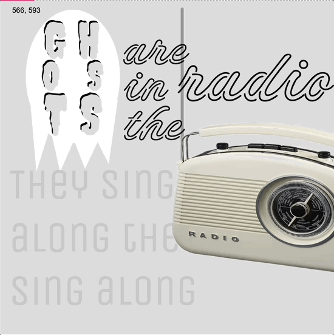

# 🗃 🗃U3LA4: Typography Project

### Prompt

If you’ve ever sat through a dull class or meeting with a song stuck in your head, you’ve probably passed the time by doodling the lyrics on whatever paper is closest. You might’ve written them out in your best handwriting - maybe even testing cursive or script - or maybe you opted for big, block letters to emphasize your favorite part. If you had lots of time on your hands, maybe you even mixed all three.

This is not a new activity - people have been doodling lyrics for years. As computers and access to design and animation software became more commonplace, people starting updating their tributes to their favorite tune to the digital space. There was even a brief trend for kinetic type, which illustrated lyrics using design, typography, and animation to the beat of the song, as in the following examples:

* [Ain’t No Rest for the Wicked](https://drive.google.com/open?id=1YUL383KYNcBM7al3lvYM0dJUJUrZd4XP) (Cage the Elephant)&#x20;
* [Harder, Better, Faster, Stronger ](https://drive.google.com/open?id=1D84cA85HJkfAfGPyrEcaQLEMMRjCj4qh)(Daft Punk)&#x20;
* [Closer](https://drive.google.com/open?id=1ecaH9iOV-bmAkIhRSE8MbxknZ8El120W) (Chainsmokers)&#x20;
* [From Paper to Screen](https://vimeo.com/69375692)

While we don’t have quite the animation skills yet to make something this elaborate, we are all able to use a variety of fonts, text, and type along with user interactions like buttons and key presses to create a tribute to our favorite song that matches the mood, beat, or rhythm of the song.

* Pick a song or poem\* that you will create a lyrical composition for&#x20;
* Use at least 3 fonts&#x20;
* Create a design that highlights your favorite parts of the song and incorporates user interactions (EX: maybe something changes colors or moves when it is clicked or a button is pressed!)&#x20;
* Integrate other p5 elements you have learned so far to improve your program

**NB:** _You can certainly set expectations around school-appropriate selections (or ask students to censor appropriately), but be sure students also know this is about picking something they like or are interested in. They can choose songs/poems in any language or genre!_

### Sample Output

[Example 1](https://editor.p5js.org/cmorgantywls/full/3X0UB\_SK2)

  .gif>)

### Culturally Responsive Best Practices

Within this design-based challenge, there are many prompts you can give students to make the project seem more relevant to them and the cultures of communities that they are a part of. (_Please recall that communities can refer to a lot of things, including just the culture of being a teen, a Minecraft player, or a KPop fan - be mindful that you are allowing students to explore choice in their creations in a way that is authentic to them!)_

_**Allowing for student choice in this project is one of the best ways to be culturally responsive!** _ Allow students the freedom to pick the song/poem/whatever that is most meaningful to them - if they say it is important, accept it as important.

### Extensions

Write your own poem and animate it as it is meant to be performed. For inspiration, check out Melisa Lozada-Oliva, who primarily writes poems that explore her culture and upbringing and are meant to be performed:

* [My Spanish](https://drive.google.com/open?id=1M8P8PYTmeEOwuDqRvPHHvLYJaMQSne\_K) (Melisa Lozada-Oliva)&#x20;
* [Bitches](https://drive.google.com/open?id=17w-j4ivEPMQOJvC0Eo\_5Am-v7rjrQQuL) (Melisa Lozada-Oliva)

