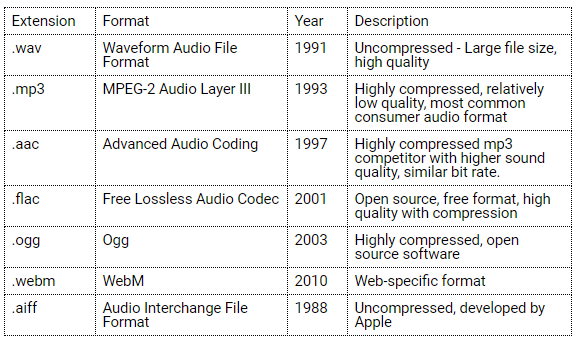

# U3LA5.1: Loading & Playing Sound Files

### Overview && Teacher Feedback

**NB: Sound is fun, and often asked for, but can be difficult to deal with in a classroom setting.** Some teachers skip this unit entirely and do not require a sound component for the final project of Unit 3 - others selectively teach sound to interested students. The three biggest challenges for sound are:

1. Finding the sounds students want, reliably and for free. (They will not be able to put in whole songs as the files are too large for the editor to support, or for copyright restrictions.)
2. Navigating program flow to ensure sounds play seamlessly and without repetition from a loop, which makes them unintelligible.
3. Ensuring all students have and use headphones to avoid room chaos.

This is not to scare you off of sound, but rather for you to stop and consider if this is a worthwhile use of time for your classroom, or if you would prefer to move directly into the final project.

This lesson covers the basics of digital audio file formats and how to download and use sounds in a p5 sketch. This lesson also introduces resources for downloading free, Creative Commons licensed sounds for use in projects and adding the ability to save a sound recording to the sound input sketch. It also covers some of the basic qualities of sound and loading a sound in a p5 sketch. Students will create a sound "sampler" using buttons to trigger recorded sounds.

The practice can be very open-ended and is meant for students to play - encourage them to bring in past skills to make the projects as exciting as possible!

### Objectives

Students will be able to:

* Search for Creative Commons license sound files and add them to a p5 project.&#x20;
* Create Sounds using p5.js&#x20;
* Identify file types
* load and play a sound file in a p5 sketch.&#x20;
* Write key conditionals to play sounds

### Suggested Duration

2 class periods (\~90 minutes)

### Blueprint Foundations Student Outcomes

**Prototype**

* Experiment with the commands of a programming language.&#x20;
* Explain why I chose specific commands to communicate my instructions.

### Vocabulary

* **audio file** - A file format that stores digital audio data&#x20;
* **File format** - the structure of how information is stored (encoded) in a computer file&#x20;
* **File compression** - data compression, source coding, or bit-rate reduction involves encoding information using fewer bits (unit of computer memory) than the original representation
* [keyPressed](https://p5js.org/reference/#/p5/keyPressed)&#x20;
* [keyTyped](https://p5js.org/reference/#/p5/keyTyped)&#x20;
* Key press to trigger sound [example](http://alpha.editor.p5js.org/owenroberts/sketches/rJiSCwUV7).

### Planning Notes

|                     Planning Notes                    |                   Materials Needed                  |
| :---------------------------------------------------: | :-------------------------------------------------: |
| There are no specific planning notes for this lesson. | Headphones are strongly suggested for all students. |

### Resources

* [17.1: Loading and Playing - p5.js Sound Tutorial ](https://www.youtube.com/watch?v=Pn1g1wjxl\_0\&index=1\&list=PLRqwX-V7Uu6aFcVjlDAkkGIixw70s7jpW)
* [How Stuff Works: Sound ](https://science.howstuffworks.com/sound-info.htm)
* [Freesound.org](https://freesound.org/help/about/) (Requires login for download) | [Freesound.org Video Tutorial ](https://www.youtube.com/watch?v=EpMEHo5luHQ)
* [Archive.org](https://archive.org/details/audio) | [Archive.org Video Tutorial ](https://www.youtube.com/watch?v=ZviF5FGEdM4\&t=9s)
* [Free Music Archive](http://freemusicarchive.org) | [Free Music Archive Video Tutorial ](https://www.youtube.com/watch?v=\_3sNMfO4joM)
* [wearecc - Creative Commons Soundcloud Channel ](https://soundcloud.com/wearecc)
* [Wikimedia Commons ](https://commons.wikimedia.org/wiki/Category:Sound)
* [Creative Commons License](https://creativecommons.org/licenses/) | [Type of Creative Commons Licenses ](https://en.wikipedia.org/wiki/Creative\_Commons\_license#Types\_of\_licenses)
* [Audio File Formats Comparison](https://www.makeuseof.com/tag/audio-file-format-right-needs/) | [Audio File Format Wikipedia ](https://en.wikipedia.org/wiki/Audio\_file\_format)
* [Data Compression](https://en.wikipedia.org/wiki/Data\_compression#Audio)

### Assessments

* Assess the learning activity. Check for the ability to: Search and upload sound files&#x20;
* Assess the Wrap Up assignment. Check for the ability to: Use conditionals

### Do Now/Warm Up

**Direct students to:**

* [Register](https://freesound.org/home/register/) for an account on Freesound.org. This requires a username, email, and password. Share your account info back with your teacher.&#x20;
* Find 1-2 sounds that you like, share them with a peers

Have extra headphone_**s**_ available because students will be playing with many different sounds, for now, it does not matter which sounds they play.

### Discussion: Usage Rights and Sound Files

As you may have guessed from the warm-up, today we will be learning how to incorporate sounds into our program.  Freesound.org is one resource, but you will have access to many, and before we start coding, we are going to spend some time talking about usable files (from a licensing and format perspective). Sound can be difficult to work with because the files are sometimes big, or copyrighted so you either can't use them (like a song on Spotify that doesn't belong to you) or behind a paywall so that you have to pay to use them.

Let's start with this: all sounds that you are going to use are sounds under the Creative Commons license, which means that they are free to use for non-commercial products. Go through a quick discussion covering these questions with students:

* What do you think media copyright is? Have you heard this term before?&#x20;
* When someone creates songs or albums, and shares digital audio, who is allowed to use that audio or listen to it?&#x20;
* Why do some services allow you to listen to audio for free while others require a subscription or purchase?

Copyright and usage rights can be a huge wormhole that has become very \*messy\* since computers, downloads, and streaming services got thrown in the mix. (It can also be a fascinating sector of law/policy for those of you who are so interested!) We are going to focus on using sounds that exist under the Creative Commons license to avoid copyright violations.&#x20;

While you don't need to memorize all the license types, be prepared to see these terms as we look for sounds - they'll be on the website along with the sound:

* **Attribution** licenses require credit given to the original author. (This can be done in a code comment or visibly on your project.)
* **ShareAlike** licenses require attribution and that any new work is licensed under identical terms. This means the person using the media in a remix or new work would have to publish using the same Creative Commons license.&#x20;
* N**oDerivs** allows for redistribution as long as the work is unchanged.&#x20;
* **NonCommercial** requires attribution and that new works must be non-commercial, or not for sale.

### Sound File Formats

Before we go start saving sounds, let's do a quick review. Sounds hosted on the web come in a variety of different files formats. File formats are standards used to encode the data of a recorded sound in a way that can be recognized and played back by many different software platforms.\
\
Most sound file formats, along with other types of media like images and videos, use a data processing technique called **compression** to make the audio data take up less computer memory, making it easier to store and transfer files on the internet.

Compression algorithms reduce file size in various ways, some of which are **lossy**, meaning that some data from the original file or recorded sound is omitted. **Lossy** formats attempt to remove parts of the sound that will go unnoticed by human listeners. (Compression formats that do not lose any data are called _**lossless**._ Creative naming, huh?)

This is a brief overview of some of the common file formats. WAV and MP3 are the most common formats found on the web, and MP3 is recommended for class projects.



Although MP3s have a lower quality, they became the most popular sound file format because they were an early way to share music relatively easily because they greatly reduced the file size or the amount of space a file takes in a computer's memory. This was especially important in the early days of the internet when connection speeds were slow and you had to choose between downloading a song at 3MB, a typical MP3 size, vs 30MB for a WAV file.

### Code Along Pt 1: Downloading and Using a Sound File

Alright, with all of that behind us, it's time to go forth and find our first sound that we will download, stick into a program, and get to play. We are going to look at **freesound.org** together because the interface can be a little wonky - while the interface may look different on each download site, the steps to upload and use a sound will remain the same.

Ask students to login to Freesound.org. We will begin by using the search bar to look for all the same sound, let's say 'saxophone solo.'

 (1).png>)

Make sure students have found this bar, then enter the search query and hit enter. The results page will list Search results with some information about the sound file and preview player. The sound can be played to preview here but can only be downloaded from the sound page. The search results show the duration of the sound file, the user who uploaded the file, the name, rating, number of downloads and date of upload.

.png>)

Point out to students that there are also areas next to the search results where you can use filters to find specific attributes within the results. Some examples of things you can use to filter your search are:

* Creative Commons Licenses
* Tags
* File Types
* Sample Rate (_The higher sample rate the higher quality sound, and also possibly larger file size._)
* Bit Depth (_a higher number means higher quality and larger file size_)
* Channels (_this refers to if there is a different recording for the left and right ear, or if they're the same.)_

Once you choose a file to use, click on the file name to go to the file page where more information is available. This page has a download button to save the file, comments from users and a link to the specific license used by the file.

 (1).png>)

Students should keep links to all of the files used for their projects, regardless of the license. When students download a sound to use in a project, they should copy the URL where they found the sound and include it in their project comments. In the comments at the top of the sketch add the link to the original sound source, like so:

```
/* 
play a sound
v0.3 final
sax sample: https://freesound.com/url/to/your/sample
*/
```

Once students click on the Download button, the file should be downloaded to the Downloads folder on their computer, depending on what operating system they are using. Locate the file and go through the steps to upload it to a p5 sketch. Files downloaded from Freesound.org tend to have long names, so like with images, it is recommended to rename the files something shorter before uploading.

Ask students to open a new p5.js editor. They'll be adding sounds the same way they added images - click the little > arrow next to the file name, and then click the downward pointing arrow and select 'Add File.' Add the file exactly as images have been added previously!

.png>)

Now we are going to do something that also looks a lot like images - we are going to preload the sound. Just like with images, remember that the name and file extension need to be EXACT in order for the program to find and identify the correct file:

```
var sound

function preload(){
  sound = loadSound("sax.wav")
}
```

Our last step, of course, is to get our sound to play, and this is where it varies from images. We can't just head to the draw function and plop sound.play() in there - why? Because the draw function, as we recall, runs on an infinite loop forever, and it runs this loop FAST. Feel free to demo to your kids, but the sound will end up playing very rapidly hundreds of times over and it will just sound like gross static/noise. To get our actual sound, we need to make sure that the sound triggers only when we want it to and will only run the one time (unless it's later triggered again).

In this example, we are going to use the mousePressed() function which 'listens' for the event of the mouse being pressed, then runs the contents of the function just one time. Build this code with your students:

```
var sound

function preload(){
  sound = loadSound("sax.wav")
}

function setup(){
  createCanvas(400,400)
}

function draw(){
  background(220)
}

function mousePressed(){
  sound.play()
}
```

### Student Practice

Post code-along, allow for a little mini practice to make sure students can find and upload sounds. Ask students to go find three sounds they would want to use in a program and upload them to the code you were working on together. Then, have them swap out the variables in mousePressed to practice playing the other sounds.

If students are quick about it, or if you would like to devote more time to this practice, see if they can create buttons that when clicked (again, using the mousePressed() function) will play different sounds. Use your best judgement based on how much time you'd like to spend on sound/how much you'd like to tie it into their final or future projects to guide you!

### More Ways to Make Sound Play

_This is likely the place where you will hit day two of this lesson. As a Do Now/Warm Up, consider having students_ [_open and duplicate this starter code_](https://editor.p5js.org/cmorgantywls/sketches/HCqOTwpz2) _- they could even read/comment or try to sample some of the sounds as they see fit._

Today, we are going to look a little more about the methods related to sound and ways we can use different major callback functions to make sounds play and stop and have different parts of our program react to those sounds. Now, it's important to note that the sound library is actually a separate p5 add-on, and as such it's [_massive_](https://p5js.org/reference/#/libraries/p5.sound)_._ We won't be learning about everything in it, but if you are interested in sound and feeling confident, you should feel free to explore and encourage your students to do the same!

To start out, head to [this starter code ](https://editor.p5js.org/cmorgantywls/sketches/HCqOTwpz2)and make a copy. Ask students to just take a look at the code and what is present and what is not - they can even leave some comments before you get started. Explain that you will be starting with what they just did, simply making a sound play by clicking, and then you will start to look at other things that can be done with sound.

Let's get the spooky sound to play first:

```
var face="😄"
var spooky
var storm
var faceSize = 100

function preload(){
  spooky = loadSound("spooky.mp3")
  storm = loadSound("storm.wav")
}

function setup() {
  createCanvas(400, 400);
}

function draw() {
  background(220);
  console.log()
  
  textSize(faceSize)
  textAlign(CENTER)
  text(face, 200, 200)
}

function mousePressed(){
  spooky.play()
}
```

This should look very familiar to what you did yesterday, but notice now we have something happening on the canvas. Let's say that we want that face to change, perhaps to something that fits the mood of the sound, and to be there _only_ when the sound is playing. We can do that with a conditional and the .isPlaying() method which works on a sound to determine if it's currently active.

All of our canvas updates will happen in the draw function, because we need them to update as the loop repeats. Recall that event functions like mousePressed() only run once, when the event happens, and will not loop or repeat the way the draw will. So let's add a little code so now we have this:

```
var face="😄"
var spooky
var storm
var faceSize = 100

function preload(){
  spooky = loadSound("spooky.mp3")
  storm = loadSound("storm.wav")
}

function setup() {
  createCanvas(400, 400);
}

function draw() {
  background(220);
  console.log()
  
  textSize(faceSize)
  textAlign(CENTER)
  text(face, 200, 200)
  
  //change face if spooky sound is playing
  if (spooky.isPlaying()){
    face = "👻"
  }
  else{
    face = "😄"
  }
}

function mousePressed(){
  spooky.play()
}
```

Cool, right? But what if we didn't want to make the mouse trigger a sound - what if we wanted it to be a key? We can use the keyPressed() function to get the same result, and can even assign specific sounds to specific keys using conditionals inside of the function, like so:

```
var face="😄"
var spooky
var storm
var faceSize = 100

function preload(){
  spooky = loadSound("spooky.mp3")
  storm = loadSound("storm.wav")
}

function setup() {
  createCanvas(400, 400);
}

function draw() {
  background(220);
  console.log()
  
  textSize(faceSize)
  textAlign(CENTER)
  text(face, 200, 200)
  
  //change face if spooky sound is playing
  if (spooky.isPlaying()){
    face = "👻"
  }
  else{
    face = "😄"
  }
}

function keyPressed(){
  if(key=="b"){ //b for boo
    spooky.play()
  }
}
```

### \[OPTIONAL] Play Duration

**NB:** _This **** section can be skipped whole class (unless you feel strongly about it), as it requires a kind of silly part of JavaScript - but you may be asked about how to get sounds to start at different spots, or only play for a certain amount of time, and that's what this is about!_

Did you know that the play function, even though we do not NEED to pass it any values, has the option to accept up to 5 values? Behind the scenes, these are the options for your play function:

play(\[startTime], \[rate], \[amp], \[cueStart], \[duration])

* **startTime** == the time in seconds into the sound when it will begin playing
* **rate** == number that controls playback rate/speed
* **amp** == amplitude (volume) of playback from 0 to 1.0
* **cueStart** == time in seconds that it will delay before starting sound
* **duration** == time in seconds that a sound will play for

These are all REALLY USEFUL, but they can be annoying because they are all optional. If I want to have a sound start 1 second in, it's pretty easy; I would just write:

**play(1)**

And the other arguments would set to defaults. But let's say I want the sound to begin one second in, and I want to wait 5 seconds after the action for the sound to start. I can't just write **play(1, 5)** because the computer would think those arguments are for startTime and rate, not startTime and cueStart. Any arguments I want to remain the default value, I would need to pass **undefined** into the function. So it would look like:

**play(1, undefined, undefined, 5)**

If I wanted a sound to play exactly as is, but only play for a 3-second duration, it would need to look like this:

**play(undefined, undefined, undefined, undefined, 3)**

This can be annoying, but it is the only way (without using arrays/objects, as seen in the next example) to access those optional values correctly. If you/your students are up to a special challenge, an alternate solution is to put all of the information for your sound into an array. JavaScript allows you to pass an array so that each value is parsed out to fill an argument in a function by using the following strategy:

```
var mySound
var args = [undefined, undefined, undefined, undefined, 0.5]

function preload(){
  mySound = loadSound("sound.mp3")
}

function setup(){
  createCanvas(400, 400)
  mySound.play(...args) //this will sort out all the info in the args array
}
```

And for an extra challenge, you could reframe this as an object. This would be especially useful if you had different play properties for a variety of different sounds:

```
var mySound

function preload(){
  mySound = {sound:loadSound("sound.mp3"), 
  args:[undefined, undefined, undefined, undefined, 0.5]
  }
}

function setup(){
  createCanvas(400, 400)
  mySound.sound.play(...mySound.args) //this will sort out all the info in the args array
}
```

Depending on how consistent you've been with objects, this may be a breeze for students, or it may be an extra and unnecessary stress, so please choose based on the needs of your learners how (and if) to review this. It may be best to deliver on an as-needed or small group basis.

### keyTyped and keyReleased

Sometimes, you may want your program to have something happen only while a key is being held and to end once the key is lifted. (Imagine, for example, a game where you are charging up for a powerful move - it may play a specific sound while the move charges, and then another once you let up the button and unleash that move. Same idea here!)

For this, we are going to explore two more event listener functions. **Please note that there are A LOT of different event listener functions in the p5 library and A LOT of different strategies to use them. Explore as you see fit!**

For now, let's make the storm sound play only when we are holding the s key (and let up as soon as we let go). That might look something like this:

```
var face="😄"
var spooky
var storm
var faceSize = 100

function preload(){
  spooky = loadSound("spooky.mp3")
  storm = loadSound("storm.wav")
}

function setup() {
  createCanvas(400, 400);
}

function draw() {
  background(220);
  console.log()
  
  textSize(faceSize)
  textAlign(CENTER)
  text(face, 200, 200)
  
  //change face if spooky sound is playing
  if (spooky.isPlaying()){
    face = "👻"
  }
  else{
    face = "😄"
  }
}

function keyPressed(){
  if(key=="b"){ //b for boo
    spooky.play()
  }
}

function keyTyped(){
  if(key == "s"){
    storm.play()
  }
}

function keyReleased(){
  storm.stop()
}
```

Now, we could also make something change on our screen when this sound is playing. Let's change the face again and also make it grow. Feel free to ask students if they have ideas to make this happen - either on your own or guided by the class, create code would then look something like this:

```
var face="😄"
var spooky
var storm
var faceSize = 100

function preload(){
  spooky = loadSound("spooky.mp3")
  storm = loadSound("storm.wav")
}

function setup() {
  createCanvas(400, 400);
}

function draw() {
  background(220);
  console.log()
  
  textSize(faceSize)
  textAlign(CENTER)
  text(face, 200, 200)
  
  //change face if spooky sound is playing
  if (spooky.isPlaying()){
    face = "👻"
  }
  else{
    face = "😄"
  }
  
  //change face if storm sound is playing
  if (storm.isPlaying()){
    face = "⛈"
    faceSize += 1
  }
  else{
    face = "😄"
    faceSize = 100
  }
}

function keyPressed(){
  if(key=="b"){ //b for boo
    spooky.play()
  }
}

function keyTyped(){
  if(key == "s"){
    storm.play()
  }
}

function keyReleased(){
  storm.stop()
}
```

There are a TON of interesting things you can do with sound, and you'll have some time to explore them in your next mini-project. Today we will do some mini-practice to help you get ready!

### Student Practice

**NB:** _The mini-project attached to this lesson is direct practice for this activity - so feel free to either dive right into it, or assign some pre_-_tasks (listed below) to get students ready._

Depending on how your classroom is feeling, consdering asking students to do any number of the following:

1. Find 5-10 sounds that you would like to use in a project.&#x20;
2. Practice getting at least one sound to play in your program using a method we reviewed today.
3. Explore the sound library and see if there are any features you may want to experiment with in this or future projects.

### Wrap Up

Ask students to answer one or more of the following questions as an exit ticket:

* Why can we not just write sound.play() in draw and call it a day?
* Name two common sound file types.
* Describe one way you learned to get sound to play, including something you like and dislike about the method.
* What does .isPlaying() do?
* What questions do you still have about working with sound?

### Extension

Please see the optional section of this lesson. Working with object literals will always be an easy way to push students a little farther in their code without having to add entirely new concepts to their learning.

Additionally, you may enjoy learning about timers and/or how to get sound from the computer mic from the 'extras' section of this curriculum as a way to supplement this lesson or extend it into multiple lessons.
